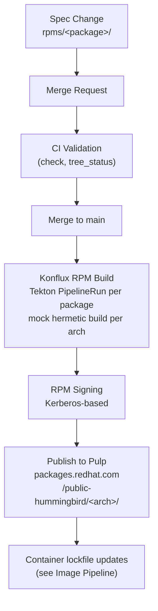

Explanation of the RPM build pipeline, from spec file changes through
validation, building, signing, and publishing to the Hummingbird package
repository.

## Overview

The RPM pipeline consists of five main stages:

1. **Spec Change** - A package spec file is modified in `rpms/<package>/`
2. **Merge Request & Validation** - CI validates the change
3. **Build** - Konflux builds RPMs per architecture via mock in hermetic mode
4. **Signing** - Built RPMs are cryptographically signed
5. **Publishing** - Signed RPMs are uploaded to the Hummingbird Pulp repository

After publishing, updated RPMs are picked up by the [container image
pipeline][image-pipeline] via lockfile updates.

[image-pipeline]: https://hummingbird-project.io/l/image-pipeline



## Stage 1: Spec Change

An RPM change begins as a commit in `rpms/<package>/`. The change typically
includes a modified `.spec` file (updated version, new patch, or Release bump)
and any associated source files or patches.

### How changes originate

| Method | Description | Modification Status |
| -------- | ------------- | --------------------- |
| Automated Fedora sync | `ci/dist_git.py update` merges upstream Fedora changes | No `native` packages |
| Upstream version update | `ci/check_upstream_versions.py --update` bumps to new upstream release | No `native` packages |
| Manual patch backport | Developer adds a CVE patch and references it in the `.spec` | Marked `modified` afterward |
| No-change rebuild | `ci/dist_git.py rebuild <package>` bumps the Release field | Status unchanged |
| Reverse dependency rebuild | `ci/dist_git.py rebuild-rev-deps <package>` rebuilds all dependents | Status unchanged |

See [Rebuilding Packages][rebuilding] and [Updating Dist-git
Packages][updating] for detailed workflows.

[rebuilding]: /l/rebuilding-packages
[updating]: /l/updating-dist-git-packages

### Package metadata

Each package has a metadata file at `metadata/<package>.json` that tracks its
relationship to upstream:

```json
{
  "source": "https://src.fedoraproject.org/rpms/curl.git",
  "branch": "rawhide",
  "sha": "abc123...",
  "version": "8.12.1",
  "release": "1",
  "modification_status": "clean",
  "upstream_repo": "https://github.com/curl/curl"
}
```

Key fields:

| Field | Purpose |
| ------- | --------- |
| `modification_status` | `clean` (auto-updates enabled), `modified` (auto-updates blocked), or `native` (no upstream) |
| `modification_reason` | Explanation of local modifications (when `modified`) |
| `release` | Upstream Fedora release at last import/update (not the spec `Release:`) |
| `upstream_repo` | Canonical upstream git repository URL |
| `track_upstream` | Version prefix constraint (e.g., `"1.26"` for golang1.26) |
| `version_transform` | Version mapping rule for CVE analysis (e.g., `dotnet_sdk_to_runtime`) |
| `cve_product` | CVE vendor/product override (e.g., `"Oracle Corporation / Oracle Java SE"`) |

See [Package Metadata Fields][metadata-fields] for `modification_status` and `release`
configuration, and [Package Modification Tracking][mod-tracking] for managing modification
status day to day.

[metadata-fields]: /l/package-metadata-fields
[mod-tracking]: /l/package-modification-tracking

## Stage 2: Merge Request & Validation

Changes reach main via merge requests. Automated MRs are created using:

- **`ci/create_mr.sh`** - Single MR with configurable options
- **`ci/rebuild_multi_mr.sh`** - One MR per package with auto-merge enabled
- **`ci/dist_git_update_multi_mr.sh`** - Automated Fedora update MRs (scheduled CI job)
- **`ci/upstream_update_multi_mr.sh`** - Automated upstream version update MRs (scheduled CI job)

### CI validation

GitLab CI runs validation jobs on every merge request:

- **`check`** - Linting, type checking, and spec validation
- **`tree_status`** - Repository consistency checks (metadata integrity, spec
  file presence)
- **Testing Farm** - Integration tests run via an IntegrationTestScenario that
  exercises built RPMs on a real RHEL compose (see [Testing](#testing) below)

### Auto-approval for chore MRs

Automated update MRs (`chore/*` branches) follow an accelerated path:

1. MR is created with auto-merge enabled
2. Konflux builds the package and posts commit statuses
3. After a delay, the `chore_mr_approval` CI job auto-approves the MR
4. GitLab merges the MR once the pipeline succeeds

## Stage 3: Build

After merging to main, Konflux builds RPMs automatically.

### Build triggers

Each package has a Tekton PipelineRun definition generated from its directory
in `rpms/<package>/` (see [`.tekton/rpms-on-pull-request.yaml.j2`][pr-template]
and the rendered [`.tekton/rpms-on-pull-request.yaml`][pr-pipeline]).
[PipelinesAsCode][pac] triggers a build when changes to
that package's directory are pushed to main. When a single push touches
multiple packages, one PipelineRun is triggered per affected package directory.
Merge request pushes also trigger builds for validation.

The `setup` package acts as a canary: changes to `ci/` or `mock/` directories
also trigger a `setup` build on pull requests, validating build infrastructure
changes before they reach main.

[pac]: https://pipelinesascode.com/
[pr-template]: ../../.tekton/rpms-on-pull-request.yaml.j2
[pr-pipeline]: ../../.tekton/rpms-on-pull-request.yaml

### Build process

The build pipeline (`build-rpm-package`) executes for each target
architecture:

1. Checks out the repository at the merge commit
2. Calculates build dependencies
3. Runs `mock` in **hermetic mode** (network-isolated with pre-fetched
   dependencies)
4. Produces RPM artifacts and build logs
5. Generates an SBOM (Software Bill of Materials)
6. Stores artifacts as Trusted Artifacts in the Konflux OCI registry

### Build architectures

Packages are built for the architectures specified in their PipelineRun
definition. Most packages build for x86_64 and aarch64. Some packages also
build for s390x and ppc64le.

### Build output

Build artifacts are stored in the Konflux OCI registry:

```text
quay.io/redhat-user-workloads/hummingbird-tenant/<package>--main
```

### Konflux resources

Build infrastructure is defined across two repositories:

- **rpms repo** (`konflux-templates/`) - Per-package Component and
  ImageRepository resources, ReleasePlanAdmission, EnterpriseContractPolicy
- **infrastructure repo** (`kubernetes/rpms-main/`) - Application,
  ReleasePlan, IntegrationTestScenario, ServiceAccount, and Secret resources

See [Konflux Resource Deployment][konflux-deploy] for details on how these
resources are managed and deployed.

[konflux-deploy]: konflux-resource-deployment.md

### Testing

RPM packages are validated through integration tests that run on Testing Farm
infrastructure.

Tests run via [Testing Farm][testing-farm] on RHEL-9-Nightly systems for both
`x86_64` and `aarch64` architectures. Test results appear as external jobs in
GitLab CI pipelines, providing pass/fail status and links to the Konflux
PipelineRun.

[testing-farm]: https://docs.testing-farm.io/

#### Test triggering

Tests are only triggered on merge requests, not on main branch builds. For a
package at `rpms/<package>/`, tests are triggered for all changes below that
directory.

#### Integration Test Scenario

Tests are triggered via an `IntegrationTestScenario` resource defined in the
[infrastructure repository][infrastructure]:

**Configuration**: `infrastructure/kubernetes/rpms-main/10-integration-test-scenarios-testing-farm.yml.j2`

The scenario uses the upstream [Testing Farm pipeline for Konflux
CI][integrations-konflux] and is parameterized as follows:

[infrastructure]: https://gitlab.com/redhat/hummingbird/infrastructure
[integrations-konflux]: https://gitlab.com/testing-farm/integrations-konflux

**Scenario parameters**:

- `COMPOSE: RHEL-9-Nightly` - Test environment OS/compose
- `PIPELINE_MODE: rpm` - Configures RPM testing mode (vs. container)
- `ARCH: x86_64,aarch64` - Architectures to test (creates separate test runs per arch)
- `PASS_SNAPSHOT_TO_TF: false` - Don't pass full snapshot JSON (package info comes via
  `IMAGE_NAME`/`IMAGE_URL` instead)
- `IMAGE_TAG:` - Version of the tmt-via-testing-farm pipeline bundle

**Key characteristics**:

- **Single scenario for all packages** - Not per-package, runs for every package build
- **Context-based triggering** - Runs on `pull_request` snapshots only
- **Package identification** - Konflux automatically provides `IMAGE_NAME` (e.g., `openssl-main`)
  and `IMAGE_URL` (OCI image with built RPMs) as environment variables

#### FMF test plan

The root folder of the `rpms` repository is marked with a `.fmf` directory to
identify it as an FMF metadata tree for tmt. The test plan in
`ci/run_tests_rpm.fmf` sets up the test instance and runs default and
package-specific tests via `ci/run_tests_rpm.sh`.

#### Test environment

These environment variables are available to the tmt test execution:

| Variable      | Description                                                              |
| ------------- | ------------------------------------------------------------------------ |
| `IMAGE_NAME`  | Component name (e.g., `openssl-main`)                                    |
| `IMAGE_URL`   | OCI image URL with built RPMs (e.g., `quay.io/.../openssl-main@sha...`)  |
| `SNAPSHOT`    | Snapshot metadata (if `PASS_SNAPSHOT_TO_TF` is true)                     |
| `COMPOSE`     | OS/compose being tested (`RHEL-9-Nightly`)                               |
| `ARCH`        | Architectures being tested (`x86_64,aarch64`)                            |
| `TMT_VERSION` | tmt version running the tests                                            |

## Stage 4: Signing

The Konflux Release Service signs built RPMs before publishing:

- **Method**: Kerberos-based signing via
  `konflux-release-signing-prod@IPA.REDHAT.COM`
- **Pipeline**: Signing runs as part of the release pipeline, before the Pulp
  upload step
- **Signing image**: `quay.io/konflux-ci/signing:latest` *(verify pinned
  digest in ReleasePlanAdmission)*

## Stage 5: Publishing to Pulp

After signing, RPMs are uploaded to the Hummingbird Pulp repository.

### Release pipeline

The `push-rpms-to-pulp` release pipeline handles the upload. Configuration is
defined in the ReleasePlanAdmission resource
(`releng/hummingbird-rpms-tech-preview-staging.yaml`):

```yaml
mapping:
  rpm-repositories:
    - name: x86_64
      repository_id: public-hummingbird-x86_64-rpms
    - name: aarch64
      repository_id: public-hummingbird-aarch64-rpms
    - name: src
      repository_id: public-hummingbird-source-rpms
    # See ReleasePlanAdmission for the full list of published architectures
```

### Pulp repository

Published RPMs are available in the
[Pulp content index](https://packages.redhat.com/api/pulp-content/public-hummingbird/):

Pulp automatically regenerates repository metadata (repodata) after each
upload, making new packages immediately resolvable by DNF/YUM clients.

## What Happens Next

Once RPMs are available in Pulp, the [container image pipeline][image-pipeline]
picks them up via lockfile updates. See the [Image Pipeline][image-pipeline]
documentation in the containers repo for the full container lifecycle.

## Related Documentation

- [Rebuilding Packages][rebuilding] - No-change rebuilds, reverse dependency
  rebuilds, and patch backports
- [Updating Dist-git Packages][updating] - Automated Fedora sync workflow
- [Package Metadata Fields][metadata-fields] - `modification_status` and
  `release` configuration
- [Package Modification Tracking][mod-tracking] - Managing modification status
  and version constraints
- [Konflux Resource Deployment][konflux-deploy] - How Konflux resources are
  defined and deployed
- [Image Pipeline][image-pipeline] - Container image pipeline (continues from
  where this document ends)
